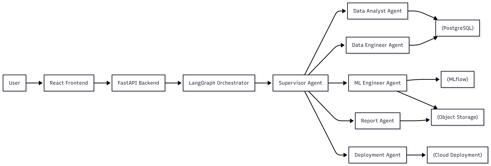
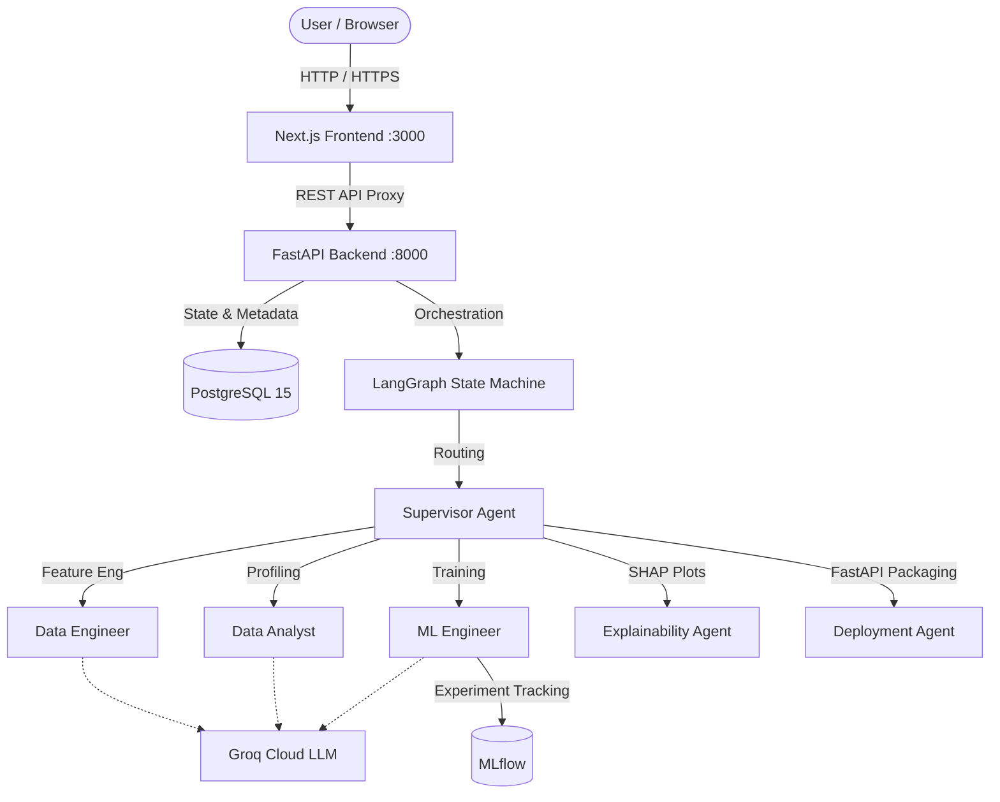

<div align="center">

# 🧠 Autonomous Data Science Platform

**End-to-End Multi-Agent AI Pipeline for Automated Data Science**

[](https://github.com/abderrahmane0402/Autonomous_Data_Science_Platform/actions/workflows/ci.yml)
[](https://fastapi.tiangolo.com)
[](https://nextjs.org)
[](https://langchain-ai.github.io/langgraph/)
[](https://scikit-learn.org/)
[](https://postgresql.org/)
[](https://opensource.org/licenses/MIT)
[](https://sabkari-dev.ddns.net/Autonomo)

Automate your entire data science lifecycle—from feature engineering and AutoML to SHAP explainability and FastAPI model deployment—using collaborating AI agents.

🌐 **Live Demo:** [https://sabkari-dev.ddns.net/Autonomo](https://sabkari-dev.ddns.net/Autonomo)
*(Note: Create an account on the live demo to begin).*

🚢 **Test Dataset:** To see the AI in action, download the classic [Titanic Dataset (CSV)](https://raw.githubusercontent.com/datasciencedojo/datasets/master/titanic.csv). Upload it to the platform, select `Survived` as the target variable, and watch the agents build the entire pipeline!

[Features](#-key-features) • [Preview](#-preview) • [Architecture](#-architecture) • [Quickstart](#-quickstart-with-docker) • [Tech Stack](#-tech-stack) • [License](#-license)

</div>

---

## 🖼️ Preview

<div align="center">
  
  <br />
  <i>(Replace with a dashboard screenshot later)</i>
</div>

---

## ⚡ Key Features

- **🤖 Multi-Agent Orchestration**: Utilizes LangGraph to coordinate specialized agents (Supervisor, Data Analyst, Data Engineer, ML Engineer, Explainability, and Deployment).
- **📈 Automated Machine Learning (AutoML)**: Automatically cleans data, engineers features, and trains multiple algorithms (XGBoost, Random Forest, LightGBM) to find the best model.
- **🔍 Explainable AI (XAI)**: Generates detailed SHAP plots to provide model transparency, feature attribution, and global importance.
- **🚀 Instant Deployment**: Packages the winning model into a fully containerized FastAPI inference server, complete with a Dockerfile, ready for production use.
- **📱 Responsive Enterprise UI**: Clean, responsive light and dark mode dashboard built with Next.js 15, Tailwind CSS, and Shadcn UI.
- **🔒 Secure Architecture**: JWT-based authentication, stateless design with PostgreSQL, and ready for deployment on any VPS.
- **🐳 Production Ready**: Fully containerized with robust multi-stage Docker builds and automated GitHub Actions CI pipelines.

---

## 🏛️ Architecture



*(You can find more detailed architectural diagrams in the `planning/` directory).*

---

## 🚀 Quickstart with Docker

The fastest way to spin up the Autonomous Data Science Platform locally or on a VPS is using Docker Compose:

### 1. Clone the repository
```bash
git clone https://github.com/abderrahmane0402/Autonomous_Data_Science_Platform.git
cd Autonomous_Data_Science_Platform
```

### 2. Configure environment variables
```bash
cp .env.example .env
```
Edit `.env` and provide your **Groq API Key** and JWT Secret:
```env
GROQ_API_KEY=gsk_your_groq_api_key_here
JWT_SECRET_KEY=your_super_secret_jwt_key
```

### 3. Start the entire application
```bash
docker compose -f docker-compose.prod.yml up -d --build
```

Access the application in your browser:
- **Web UI**: `http://localhost:3000` (Or your VPS public IP / Domain)
- **FastAPI Interactive Docs**: `http://localhost:8000/docs`

---

## 🛠️ Tech Stack

| Layer | Technology |
|---|---|
| **Frontend** | Next.js 15 (App Router), React, Tailwind CSS, Shadcn UI |
| **Backend API** | FastAPI, Pydantic, SQLAlchemy, Uvicorn |
| **AI Agents** | LangGraph, LangChain, Groq (Qwen/Llama) |
| **Data Science** | Pandas, Scikit-Learn, XGBoost, LightGBM, SHAP, MLflow |
| **Database** | PostgreSQL 15 (Production) / SQLite (Local) |
| **DevOps & CI** | Docker, Docker Compose, GitHub Actions |

---

## 💻 Local Development Setup

If you prefer to run the frontend and backend natively outside Docker for development:

### 1. Backend Setup
```bash
cd backend
python -m venv .venv
source .venv/bin/activate  # On Windows: .venv\Scripts\activate
pip install -r requirements.txt

# Ensure .env exists (create from template in root)
cp ../.env.example .env

# Start API (SQLite will be used by default)
uvicorn backend.main:app --reload --port 8000
```

### 2. Frontend Setup
```bash
cd frontend
npm install
npm run dev
```
Open `http://localhost:3000` in your browser.

---

## 📄 License

This project is licensed under the [MIT License](LICENSE).
